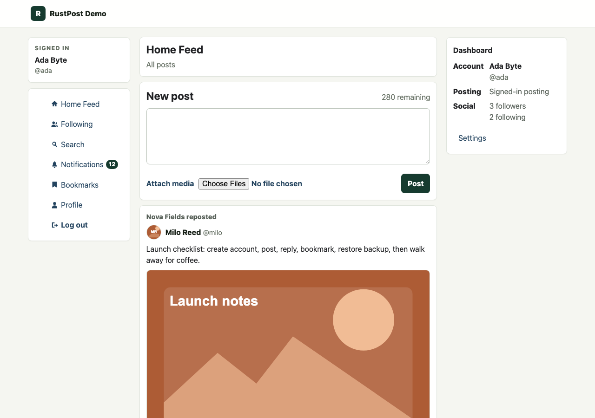
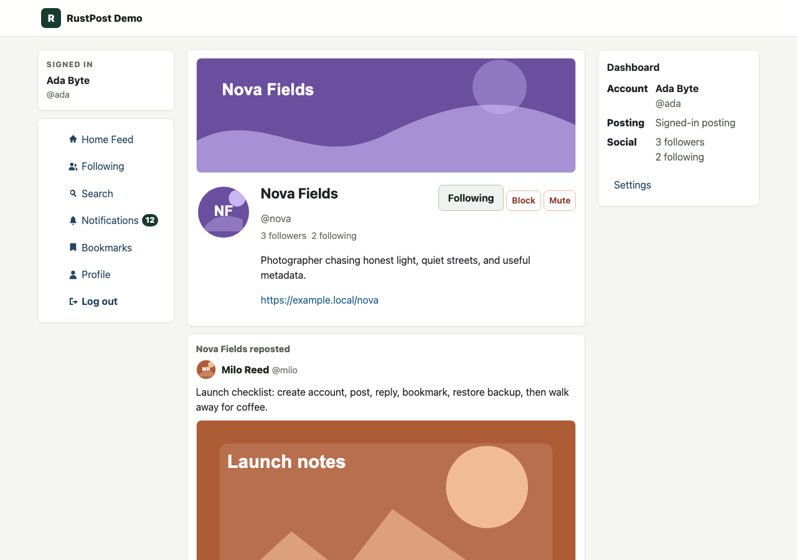
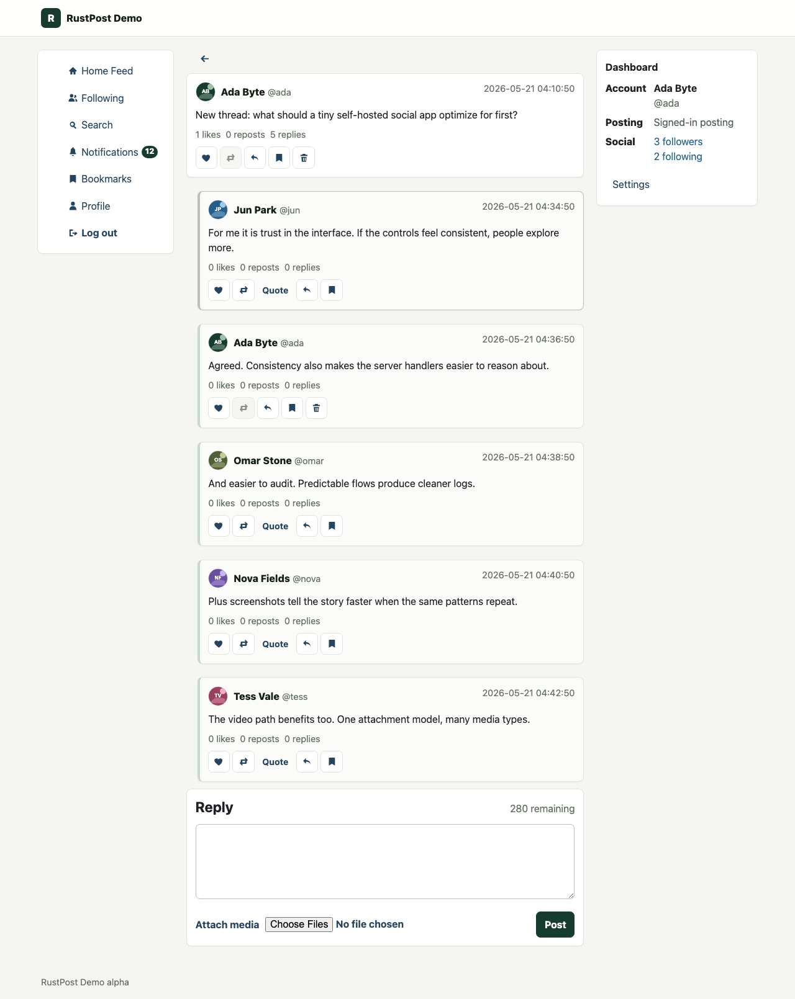
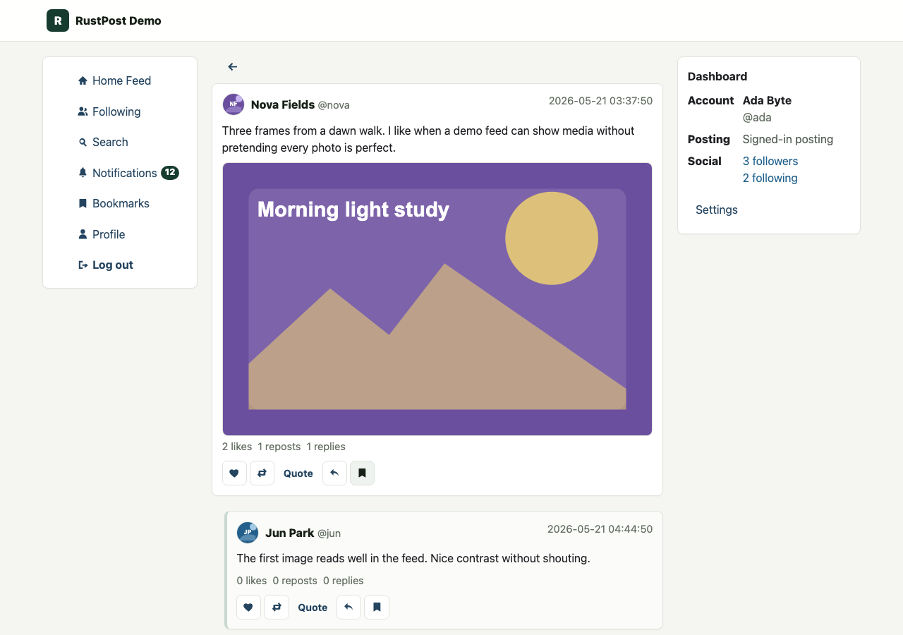
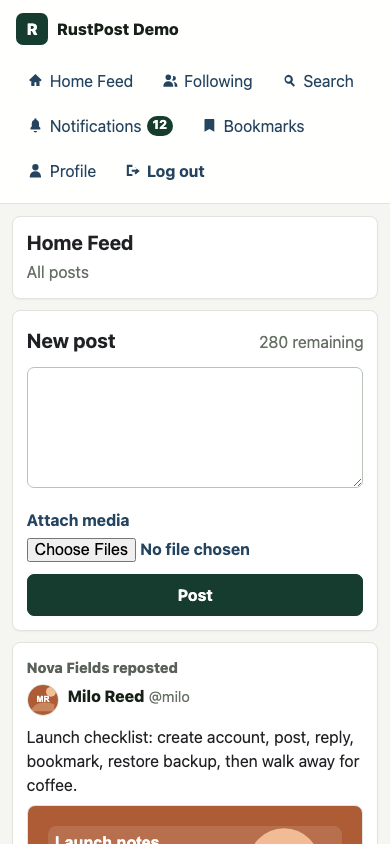

<div align="center">

<br/>

```
██████╗ ██╗   ██╗███████╗████████╗██████╗  ██████╗ ███████╗████████╗
██╔══██╗██║   ██║██╔════╝╚══██╔══╝██╔══██╗██╔═══██╗██╔════╝╚══██╔══╝
██████╔╝██║   ██║███████╗   ██║   ██████╔╝██║   ██║███████╗   ██║   
██╔══██╗██║   ██║╚════██║   ██║   ██╔═══╝ ██║   ██║╚════██║   ██║   
██║  ██║╚██████╔╝███████║   ██║   ██║     ╚██████╔╝███████║   ██║   
╚═╝  ╚═╝ ╚═════╝ ╚══════╝   ╚═╝   ╚═╝      ╚═════╝ ╚══════╝   ╚═╝   
```

**A single-binary, self-hosted microblog — yours alone, with no cloud required.**

[](https://github.com/csd113/RustPost/actions)
[](https://www.rust-lang.org/)
[](https://www.sqlite.org/)
[](https://www.torproject.org/)
[](./LICENSE)

[**Getting Started**](#-getting-started) · [**Configuration**](#-configuration) · [**CLI Reference**](#-cli-reference) · [**Security**](#-security-model) · [**Tor / Arti**](#-tor--arti)

</div>

---

## Overview

RustPost is a **single-binary, self-hosted microblogging platform** written in Rust. It is deliberately single-instance and non-federated: one operator runs one SQLite-backed site with full social features, served as plain server-rendered HTML with no frontend build chain.

> **Design philosophy:** Small, auditable modules over framework magic. Security-sensitive behavior centralized. No JavaScript bundler. No cloud dependency. No federation surface.

This repository is a **production-oriented MVP** — not a toy, but not overengineered. The goal is a system you can read end to end, deploy in minutes, and trust.

---

## ✨ Features

### Accounts & Identity
| Feature | Details |
|---|---|
| Password hashing | Argon2id — never stored in plaintext |
| Sessions | Server-side, HttpOnly, SameSite=Lax cookies |
| Profile customization | Bio, avatar, and banner with WebP conversion |
| Admin CLI | Create admins and reset passwords from the command line |

### Social Features
| Feature | Details |
|---|---|
| Posts | Up to 280 Unicode characters |
| Replies & Threads | Threaded conversations with full timeline rendering |
| Reposts | First-class timeline events; deleted originals render gracefully |
| Follows, Blocks & Mutes | Standard social graph primitives |
| Likes & Bookmarks | Likes are public; bookmarks are private |
| Notifications | In-app notification feed |
| Search | Full-text search via SQLite FTS5 + user matching |
| Anonymous posting | Supported but **disabled by default** |

### Media Pipeline
| Feature | Details |
|---|---|
| Upload handling | Multipart with content sniffing and size limits |
| Image conversion | JPEG / PNG / GIF / WebP → WebP (requires `ffmpeg`) |
| Video conversion | MP4 / WebM / QuickTime → WebM VP9 (requires `ffmpeg`) |
| Fallback | Serves original format safely when conversion is unavailable |
| Timeouts | 120 s for images · 300 s for video |

### Operations
| Feature | Details |
|---|---|
| Database | SQLite with WAL, foreign keys, migrations, FTS5, and timeline indexes |
| Rate limiting | SQLite-backed per-user and per-IP limits for all write operations |
| Backups | Tar archive of DB + settings + media + optional Tor keys |
| Restore | Path validation rejects traversal, symlinks, absolute paths, and Unicode bypass attempts |
| Admin dashboard | Site health, users, media jobs, conversion state, and backup management |
| Tor / Arti | Embedded onion-service startup — clearnet-only, Tor-only, or dual mode |

---

## Platform Preview

RustPost renders as plain server-side HTML with full social interactions, profiles, threads, and media attachments.

| Home feed | Profile |
|---|---|
|  |  |

| Threaded replies | Media posts |
|---|---|
|  |  |

| Mobile layout |
|---|
|  |

The screenshots above were captured from a local generated demo instance with fictional accounts and local placeholder media only. To inspect the same style of demo locally, see [Demo Preview](docs/demo-preview.md).

---

## 🚀 Getting Started

### Prerequisites

- **Rust 1.90+** — install via [rustup](https://rustup.rs/)
- **ffmpeg** *(optional)* — enables image and video conversion. RustPost boots and runs without it.

### Build

```sh
cargo build --release
```

This produces two binaries in `target/release/`:

| Binary | Purpose |
|---|---|
| `rustpost` | Primary server + CLI |
| `rustpost-cli` | Identical CLI surface — useful for running admin commands while the server is managed separately |

### First Run

```sh
# Linux / macOS
./target/release/rustpost --data-dir ./rustpost-data serve

# Windows (PowerShell)
.\target\release\rustpost.exe --data-dir .\rustpost-data serve
```

> If no subcommand is provided, `serve` is assumed.

On first boot, RustPost initializes the data directory automatically:

```
rustpost-data/
├── settings.toml          ← generated config with safe defaults
├── app.sqlite3            ← main database
├── uploads/
│   ├── originals/
│   ├── images/
│   ├── videos/
│   └── thumbs/
├── backups/
├── logs/
└── tor/
    └── onion-service/
```

> **Note:** All runtime paths are derived from `--data-dir` (or the executable location as fallback). RustPost does not rely on the current working directory.
> Runtime data is local operator state. Databases, uploads, logs, backups, Tor key material, and temporary upload files under `rustpost-data/` should not be committed to git.

### Create Your First Admin

When `serve` starts, RustPost prints the data directory, settings path, database path, bind address, and whether an admin account exists. If no admin exists, the terminal output includes the bootstrap commands.

The preferred local setup path hides the password while you type:

```sh
./target/release/rustpost --data-dir ./rustpost-data create-admin-interactive
```

For scripted deployments, the non-interactive command is still available. Be aware that command-line arguments can be visible to other local processes on some systems:

```sh
./target/release/rustpost --data-dir ./rustpost-data create-admin alice s3cr3tpassword
```

Then open [http://127.0.0.1:8080](http://127.0.0.1:8080) and log in.

### Timeline

| Label | Meaning |
|---|---|
| Home Feed | Public top-level posts from your configured site |

Replies remain attached to their parent thread. They render inside the thread view and are not shown as unrelated top-level Home Feed posts.

---

## 🖥 CLI Reference

```sh
rustpost init                                       # Initialize data directory
rustpost check                                      # Validate config and data directory
rustpost create-admin <username> <password>         # Create an admin account
rustpost create-admin-interactive                   # Create an admin with hidden password prompts
rustpost reset-admin-password <username> <password> # Reset an admin's password
rustpost seed-demo                                  # Seed a guarded local demo instance under target/debug/rustpost-demo
rustpost serve                                      # Start the HTTP server (default)
rustpost backup                                     # Create a backup archive
rustpost backup --include-tor-keys                  # Backup including Tor private keys
rustpost restore <archive.tar>                      # Restore from a backup
rustpost restore <archive.tar> --include-tor-keys   # Restore including Tor keys
rustpost print-onion-address                        # Print the current .onion hostname
```

---

## ⚙ Configuration

`settings.toml` is generated on first run with conservative, safe defaults. Edit it to match your deployment.

### Site name

The visible site name is configured in `settings.toml`:

```toml
[site]
name = "RustPost"
```

Changing `site.name` updates the rendered browser title, header brand, footer, and user-facing site copy. Binary names, package names, cookie names, and data paths remain `rustpost` for compatibility.

### Clearnet only (default)

```toml
[server]
host = "127.0.0.1"
port = 8080
cookie_secure = false   # set true when running behind HTTPS

[tor]
enabled = false
tor_only = false
```

### Tor only

```toml
[server]
host = "127.0.0.1"
port = 8080

[tor]
enabled = true
tor_only = true                        # binds only the loopback Arti forwarder
data_dir = "tor"
onion_service_name = "microblog"
bootstrap_timeout_secs = 120
max_concurrent_streams = 512
```

### Dual mode (clearnet + onion simultaneously)

```toml
[server]
host = "127.0.0.1"
port = 8080

[tor]
enabled = true
tor_only = false                       # clearnet starts immediately; onion boots in background
data_dir = "tor"
onion_service_name = "microblog"
bootstrap_timeout_secs = 120
max_concurrent_streams = 512
```

### Rate limiting

All limits are configured under `[moderation]`:

```toml
[moderation]
posts_per_minute                    = 5
replies_per_minute                  = 10
reposts_per_minute                  = 10
account_creations_per_ip_per_day    = 3
failed_login_attempts_per_15m       = 10
anonymous_posts_per_ip_per_hour     = 10
```

> Authenticated limits are keyed by user ID. Registration, failed login, and anonymous limits are keyed by direct peer IP. Forwarded headers are **not trusted by default**.

---

## 🔒 Security Model

| Control | Implementation |
|---|---|
| Passwords | Argon2id — never stored in plaintext |
| Session cookies | HttpOnly · SameSite=Lax · `Secure` controlled by config |
| CSRF | All state-changing authenticated routes require a CSRF token |
| Output escaping | User content is HTML-escaped before rendering |
| Upload safety | Filenames ignored; content sniffed; stored under fixed upload roots |
| SVG | Not an allowed default upload type |
| Admin routes | Require an admin session **and** CSRF protection |
| Trusted proxies | Explicit config; forwarded headers are not blindly trusted |
| Tor key material | Not stored in SQLite, not logged, not rendered in UI or admin health |

---

## 🧅 Tor / Arti

RustPost embeds [Arti](https://gitlab.torproject.org/tpo/core/arti) (the Rust Tor implementation) directly in the binary. No external `tor` daemon required.

**Behavior by config:**

| `tor.enabled` | `tor_only` | Behavior |
|---|---|---|
| `false` | — | No Arti tasks started. Pure clearnet. |
| `true` | `false` | Clearnet binds immediately. Arti onion service starts in background. If Tor fails, clearnet keeps running and admin health reports the error. |
| `true` | `true` | Only a loopback listener is bound for Arti forwarding. Startup **fails** if Arti/onion startup fails. |

**Arti crate versions (Arti 2.3.0 / 2026-05-07):**

```
arti-client      = 0.42.0   # bootstraps the embedded Tor client and onion service
tor-hsservice    = 0.42.0   # onion-service config, handle, and rendezvous streams
tor-proto        = 0.42.0   # inspect and accept incoming onion stream requests
tor-cell         = 0.42.0   # cell-level protocol handling
tor-rtcompat     = 0.42.0   # Tokio-compatible Arti runtime
rustls           = 0.23     # ring crypto provider required by Arti's rustls stack
```

> **Dependency note:** `cargo tree -i libsqlite3-sys` should show exactly one version. RustPost uses `rusqlite` rather than `sqlx 0.9` (alpha) specifically to keep the `libsqlite3-sys` dependency unified with the Arti family.

**Tor data layout:**

```
rustpost-data/tor/
├── cache/                     ← Arti directory cache
└── onion-service/
    └── state/                 ← onion-service private keys (mode 0700 on Unix)
```

**Backups and Tor keys:**

```sh
rustpost backup                          # excludes Tor keys (safe default)
rustpost backup --include-tor-keys       # opt-in to include keys
rustpost restore archive.tar             # rejects Tor key paths unless flag given
rustpost restore archive.tar --include-tor-keys
```

Restore path validation rejects: absolute paths, traversal sequences, symlinks/hardlinks, Windows drive prefixes, backslash paths, encoded traversal or slash markers, and slash-like Unicode bypass characters.

---

## 🎬 Media & FFmpeg

RustPost **boots and runs without `ffmpeg`**. Conversion is optional and detected at runtime. Admin health reports whether `ffmpeg` is present and whether WebP/VP9 encoders are available.

**When `ffmpeg` is detected:**

- Images (JPEG, PNG, GIF, WebP) → converted to **WebP**
- Videos (MP4, WebM, QuickTime) → converted to **WebM VP9** with `yuv420p` and explicit BT.709 color metadata to avoid browser playback issues
- Image conversions: **120 s timeout**
- Video conversions: **300 s timeout**
- Conversion status (successes, fallbacks, stderr summaries) visible in admin media/health pages

**When `ffmpeg` is absent or conversion fails:** RustPost serves the original upload, provided it is an allowed content type.

Profile pictures and banners follow the same media pipeline as post uploads.

---

## 💾 Backup & Restore

```sh
# Create a backup (DB + settings + media)
rustpost-cli backup

# Include Tor onion-service keys
rustpost-cli backup --include-tor-keys

# Restore into a fresh data directory
rustpost-cli restore rustpost-backup-2026-05-18T....tar

# Restore including Tor keys
rustpost-cli restore rustpost-backup-2026-05-18T....tar --include-tor-keys
```

> Archive names include subsecond precision to avoid same-second collisions.

---

## 🧪 Development

```sh
cargo update                                                           # update dependencies
cargo fmt --all --check                                                # check formatting
cargo clippy --workspace --all-targets --all-features -- -D warnings  # lint
cargo test --workspace --all-features                                  # run tests
```

### Local UI Regression Pass

Run the app locally with a disposable data directory:

```sh
cargo build --workspace --all-features
./target/debug/rustpost --data-dir /tmp/rustpost-alpha serve
```

Then open [http://127.0.0.1:8080](http://127.0.0.1:8080). The server initializes the data directory on first boot.

**CI matrix** (GitHub Actions, Rust 1.90):

| Platform | Arch |
|---|---|
| Linux | x86\_64 |
| Linux | ARM64 |
| macOS | Apple Silicon |
| Windows | x86\_64 |

CI runs: format check → Clippy → tests → release build. A separate strict Clippy job runs `clippy::all`, `clippy::pedantic`, `clippy::nursery`, and `clippy::cargo`.

### Release Artifacts

Tagged releases matching `v*` produce:

```
rustpost-linux-x86_64.tar.gz
rustpost-linux-aarch64.tar.gz
rustpost-macos-aarch64.tar.gz
rustpost-windows-x86_64.zip
```

Each archive contains `rustpost`, `rustpost-cli`, `README.md`, `LICENSE`, and optional notice files. A `.sha256` checksum is generated for each archive. Runtime data (databases, uploads, backups, logs, Tor keys) is never included.

---

## 📦 Dependencies

| Crate | Role |
|---|---|
| `axum` | HTTP routing and multipart handling |
| `tokio` | Async runtime, filesystem, process, and signals |
| `rusqlite` | SQLite access via a dedicated DB worker; WAL, FK, migrations |
| `argon2` | Argon2id password hashing |
| `rand_core` + `uuid` | Secure salts and opaque generated tokens/filenames |
| `infer` | Content-based media type detection |
| `tower-http` | Static upload serving and HTTP tracing |
| `clap` | CLI argument parsing |
| `toml` + `serde` | Config load/save |
| `tar` + `walkdir` | Backup and restore archive handling |
| `arti-client` | Bootstraps the embedded Tor client and onion service |
| `tor-hsservice` | Onion-service config, running handle, and rendezvous streams |
| `tor-proto` + `tor-cell` | Inspect and accept incoming onion stream requests |
| `tor-rtcompat` | Tokio-compatible Arti runtime |
| `rustls` | Ring crypto provider for Arti's rustls stack |
| `tracing` | Privacy-conscious operational logging |

---

## ✅ Release Verification

*Last sweep: **May 18, 2026***

<details>
<summary>Verified locally</summary>

- Fresh `--data-dir` boot creates `settings.toml`, `app.sqlite3`, upload roots, backup/log dirs, and Tor state dirs.
- `rustpost-cli check` passes on a fresh data directory with `tor.enabled = false`.
- Clearnet serving on `127.0.0.1:8080` loads `/home`.
- Registration, login, post creation, replies, repost rendering, likes, bookmarks, follows, notifications, admin health, and CSRF-protected logout all work through live HTTP requests.
- Anonymous posting is disabled by default — anonymous users cannot see the composer and anonymous post attempts are rejected.
- Non-admin users cannot access admin health; anonymous users cannot access authenticated pages.
- `ffmpeg` 8.1.1 detected with WebP and VP9 support. Image, profile picture/banner, and small video uploads live-tested; WebP and WebM outputs produced; admin media/health pages reported conversion state correctly.
- Normal backups include DB, settings, and media; exclude Tor keys. `--include-tor-keys` includes them only when explicitly requested. Restore into a fresh data directory completed and `check` passed.
- Backup archive names include subsecond precision — no same-second overwrite collisions.
- `tor_only = false` live-tested: clearnet bound quickly, Arti produced a real `.onion` hostname, Tor Browser reached `/home` through the onion.
- `tor_only = true` live-tested: no clearnet listener exposed, loopback-only binding confirmed, real `.onion` hostname produced and reached via Tor Browser.
- Both `rustpost` and `rustpost-cli` pass `check` on a fresh data directory.

</details>

<details>
<summary>Partially verified / environment-dependent</summary>

- Live Tor reachability depends on Tor network access and descriptor publication time. The May 2026 sweep succeeded with a temporary onion identity; future release checks should repeat with a non-temporary identity if a stable onion address is required.
- Tor private key material was not rendered in admin health or normal logs during the sweep. Operational text may reference key paths or the `--include-tor-keys` flag but does not print key contents.

</details>

---

## ⚠ Known Limitations

- **Tor verification requires network access** — may time out in restricted build or CI environments.
- **Onion virtual port** — HTTP virtual port 80 is mapped to the RustPost listener; custom onion virtual ports are not yet configurable.
- **Synchronous media conversion** — conversion happens inline during upload; no background queue.
- **Reports and admin toggles** — present in schema and admin structure but functionality is minimal in the current MVP.
- **Search** — uses SQLite FTS5 with simple user matching and fixed result limits; no ranking tuning yet.
- **UI polish** — server-rendered HTML/CSS has been brought to alpha quality, but final visual design and broader accessibility review are still future work.

---

## 📄 License

See [LICENSE](./LICENSE) for terms.

---

<div align="center">

Built with Rust 🦀 · Powered by SQLite · Optional Tor via Arti

[github.com/csd113/RustPost](https://github.com/csd113/RustPost)

</div>
