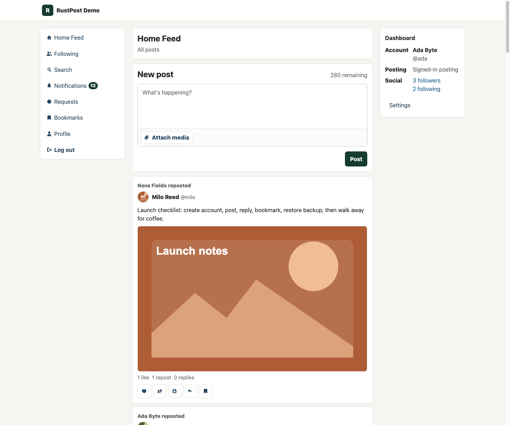
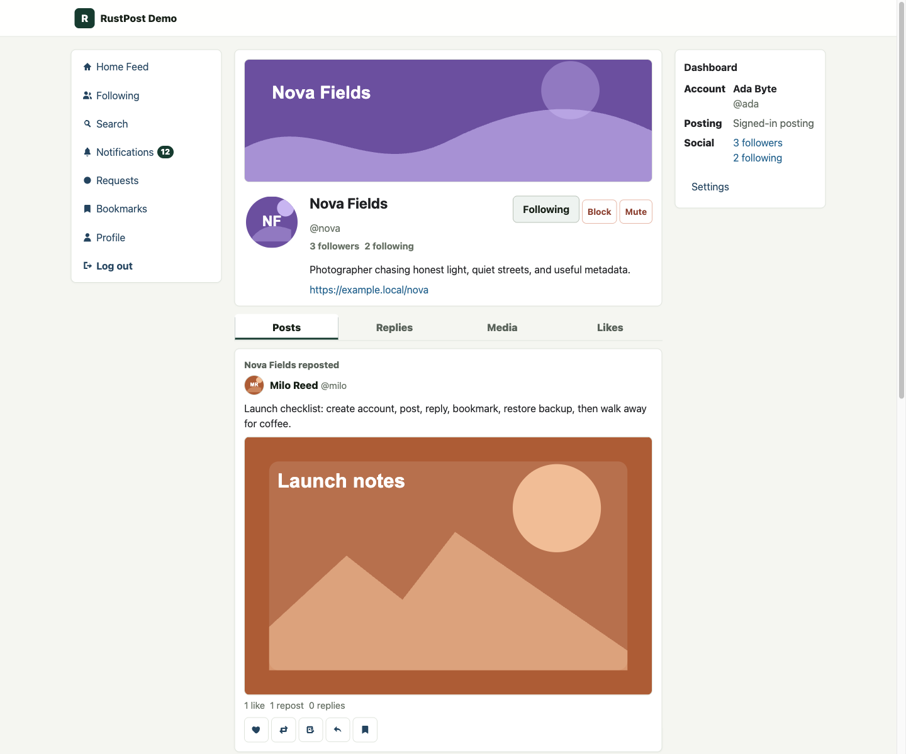
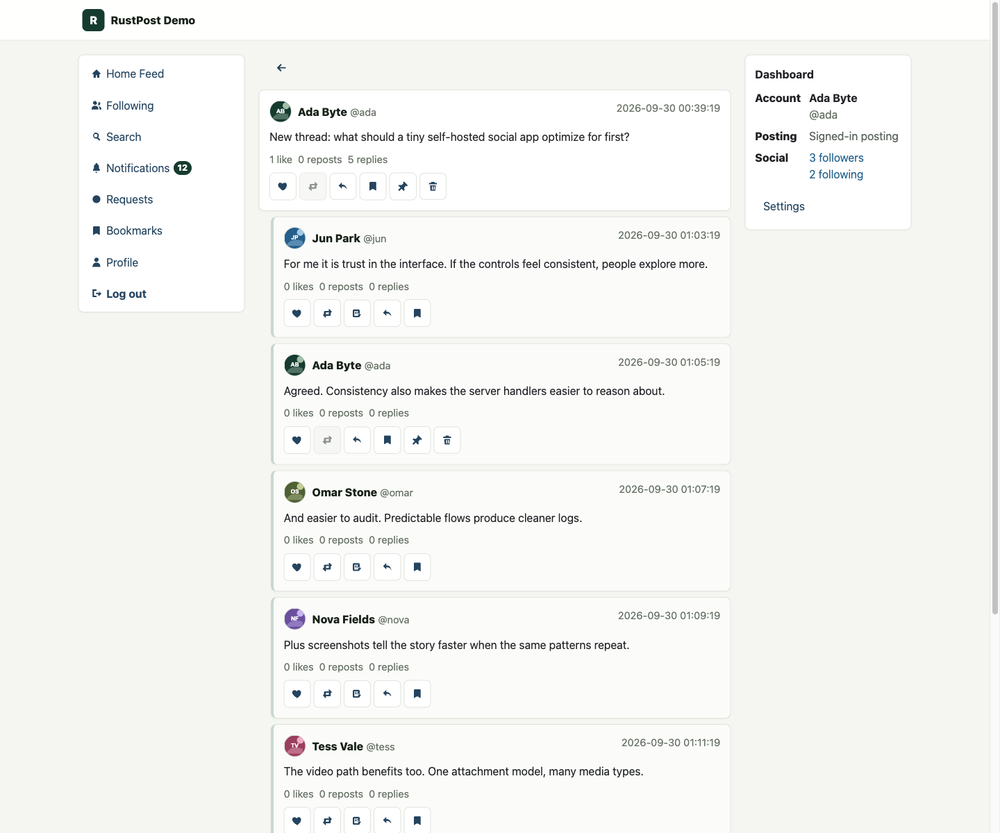
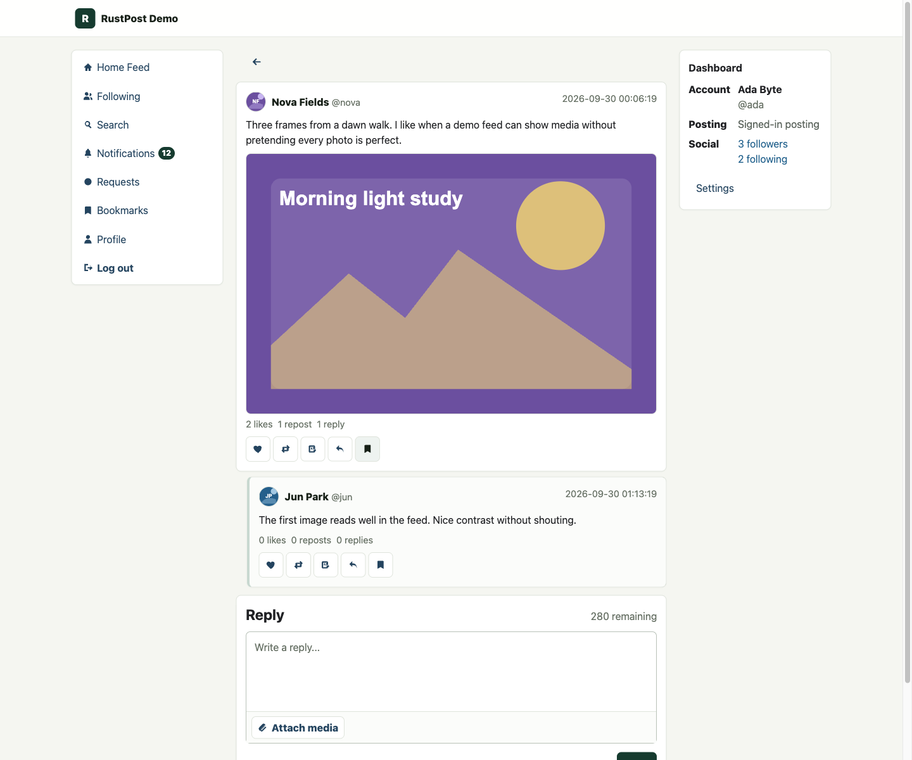
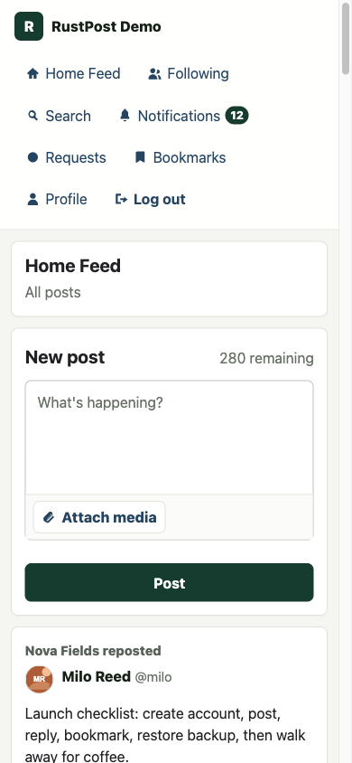

# RustPost

**Your own small social network, on your own computer or server.**

[](https://github.com/csd113/RustPost/actions/workflows/ci.yml)
[](https://github.com/csd113/RustPost/releases/latest)
[](LICENSE)

RustPost is a place to share short posts, photos, and videos, follow people, and join conversations. You run the site and control its accounts, settings, and data. People use it through a web browser, including on phones.

It runs as one application with a local database. No separate database server or cloud account is required. Each RustPost site is its own community; accounts and posts are not shared with other social networks.

[See the app](#see-the-app) · [Get started](#getting-started) · [Docker setup](#run-the-container) · [Settings](#settings-and-administration) · [Documentation](#documentation)

## What you can do

- **Post and talk:** share up to 280 characters, reply in threads, repost, like, and save private bookmarks.
- **Share media:** attach images and videos, and add a profile picture, banner, and bio.
- **Find your people:** follow accounts, search posts and users, and receive notifications.
- **Control your experience:** block or mute accounts, hide words, or require approval for new followers.
- **Manage your account:** change your username, export or import your data, or request deletion with a configurable grace period.
- **Run your community:** manage users, publish announcements, pause posting with maintenance mode, and create or restore backups.

Optional Tor support lets the same site be reached through an onion address. See the [operator guide](docs/operator-guide.md#tor--arti) for setup and limitations.

## See the app

### Home feed

Read posts from the community and share an update from the same page.



### Profiles and conversations

Profiles bring a person's bio, follows, and posts together. Replies stay with their original post so conversations are easy to follow.

| Profile | Conversation |
| --- | --- |
|  |  |

### Media and mobile

Images appear within posts, and the layout adapts to smaller screens.

| Image post | Phone layout |
| --- | --- |
|  |  |

These screenshots use fictional accounts and locally generated sample media. You can [run the same demo](docs/demo-preview.md) without using real account data.

## Getting started

Choose the installation method that suits you:

| Method | What you need | Best for |
| --- | --- | --- |
| [Docker container](#run-the-container) | Docker installed and running | Running the ready-made app with media conversion included |
| [Download the app](#download-the-app) | A matching release for your computer | Running RustPost without Docker or a Rust installation |
| [Build from source](#build-from-source) | Rust 1.91 or newer | Developers and people who want to build it themselves |

The current release is **[v1.0.0](https://github.com/csd113/RustPost/releases/tag/v1.0.0)**. It includes downloadable apps and the new Docker image. See the [changelog](CHANGELOG.md) for the full release notes.

### Run the container

The Docker image packages RustPost and `ffmpeg`, the tool used to convert uploaded photos and videos. It supports Linux **amd64** and **arm64**, including Docker environments on compatible Windows and macOS computers.

**1. Start RustPost.** Open a terminal and run:

```sh
docker volume create rustpost-data
docker run -d --name rustpost \
  -p 127.0.0.1:8080:8080 \
  -v rustpost-data:/data \
  --restart unless-stopped \
  ghcr.io/csd113/rustpost:1.0.0
```

Docker downloads the image if needed. The `rustpost-data` volume holds your settings, accounts, posts, uploads, and backups, so they survive replacing the container. Keep this volume when upgrading.

**2. Create your administrator account.** This account manages the site:

```sh
docker exec -it rustpost rustpost-cli --data-dir /data create-admin-interactive
```

Follow the username and password prompts. Your password is hidden as you type.

**3. Open [http://127.0.0.1:8080](http://127.0.0.1:8080)** in your browser and log in. This setup makes the site available on your computer only. To let others visit, follow [Making your site public](#making-your-site-public).

Useful container commands:

```sh
docker logs rustpost       # View startup messages and errors
docker stop rustpost       # Stop the app
docker start rustpost      # Start it again
docker restart rustpost    # Reload after changing settings
```

Use `ghcr.io/csd113/rustpost:1.0.0` to select this release explicitly. The `latest` tag currently points to the same release, but can change when a newer version is published.

For custom storage mounts, configuration, backups, and upgrades, see the [Docker guide](docs/docker.md).

### Download the app

Open the [v1.0.0 downloads](https://github.com/csd113/RustPost/releases/tag/v1.0.0) and choose the archive for your computer. Download its matching `.sha256` file too; it lets you check that the download is intact.

| Computer | Archive |
| --- | --- |
| Linux, Intel/AMD 64-bit | `rustpost-linux-x86_64.tar.gz` |
| Linux, ARM64 | `rustpost-linux-aarch64.tar.gz` |
| macOS, Apple Silicon | `rustpost-macos-aarch64.tar.gz` |
| Windows, Intel/AMD 64-bit | `rustpost-windows-x86_64.zip` |

Check the archive before extracting it. For example, on Linux:

```sh
sha256sum -c rustpost-linux-x86_64.tar.gz.sha256
tar -xzf rustpost-linux-x86_64.tar.gz
```

On macOS, use `shasum -a 256 -c rustpost-macos-aarch64.tar.gz.sha256`, then extract the archive. On Windows, compare `Get-FileHash .\rustpost-windows-x86_64.zip -Algorithm SHA256` with the checksum file, then extract the ZIP.

From the folder where you extracted the archive, start the app:

```sh
# Linux or macOS
./rustpost/rustpost-cli --data-dir ./rustpost-data serve
```

```powershell
# Windows PowerShell
.\rustpost\rustpost-cli.exe --data-dir .\rustpost-data serve
```

Follow the first-run administrator prompts. If no prompt appears, open a second terminal in the same folder and run:

```sh
./rustpost/rustpost-cli --data-dir ./rustpost-data create-admin-interactive
```

On Windows, use `.\rustpost\rustpost-cli.exe` instead. Then open [http://127.0.0.1:8080](http://127.0.0.1:8080) and log in.

Installing `ffmpeg` is optional for downloaded apps. Without it, RustPost can serve allowed uploads in their original format.

### Build from source

With [rustup](https://rustup.rs/) installed, run these commands from the repository folder (rustup selects the pinned compiler):

Development and release builds use the Rust 1.99.0 pin in `rust-toolchain.toml`. CI also checks the latest `stable` compiler so future compiler and Clippy changes are reviewed before updating the release pin. After each stable release, install that exact version with rustup, update the toolchain/CI/container pins together, and pass the full validation gates before using it for releases. `Cargo.toml` keeps Rust 1.91 as the minimum supported Rust version (MSRV); it is a compatibility floor, not the build compiler pin. Existing toolchains and the global rustup default need no changes.

```sh
cargo build --release --locked
./target/release/rustpost-cli --data-dir ./rustpost-data serve
```

Follow the first-run administrator prompts, then open [http://127.0.0.1:8080](http://127.0.0.1:8080). On Windows, the executable is `.\target\release\rustpost-cli.exe`.

## Using your site

After logging in, use the post box to share an update. Open a post to read or write replies, or visit someone's profile to follow them. The Home Feed shows public posts from your site; replies appear in their conversations.

Use **Settings** to edit your profile and account preferences. Administrators also have an **Admin** area for users, site announcements, maintenance mode, media status, and backups.

Registration is enabled by default. Anonymous posting is disabled by default.

## Settings and administration

RustPost creates a `settings.toml` file on first run. This is a plain text settings file; its comments explain each option. Edit the existing entries and restart RustPost to apply file changes.

- **Docker:** the file is `/data/settings.toml` inside the saved volume. See [Editing Docker settings](docs/docker.md#editing-settings).
- **Downloaded or source-built app:** the examples above save it at `rustpost-data/settings.toml`.

For example, change `name` under `[site]` to rename your community, or set `registration_enabled = false` under `[accounts]` to close new signups. Detailed settings are in the [operator guide](docs/operator-guide.md#configuration).

Always use the same `--data-dir` when starting the app or running administrator commands. That folder contains the database, uploads, settings, and other site files. Keep it private and out of Git.

### Making your site public

The setup examples above accept visits from your own computer. For a public site, use a server and a reverse proxy—a service that provides HTTPS and forwards visitors to RustPost.

Set `server.public_url` to your HTTPS address and `server.cookie_secure = true`. Keep the app's port private behind the proxy. IP-based rate limits use the direct connection address, so visitors behind a proxy can share a limit. The [operator guide](docs/operator-guide.md#security-model) and generated settings explain the security controls.

The Docker image sets its internal listener to `0.0.0.0` on first boot so port forwarding works. The example still keeps the published port on your computer's loopback address, `127.0.0.1`.

### Backups

Use **Admin → Backups** to create and download a backup, configure automatic backups, or restore an archive. Automatic backups are off by default. Keep a copy outside the computer running RustPost.

You can also create a backup from the terminal:

```sh
# Docker
docker exec rustpost rustpost-cli --data-dir /data backup

# Downloaded app (Linux or macOS)
./rustpost/rustpost-cli --data-dir ./rustpost-data backup
```

Backups include the database, settings, and media. Tor private keys are excluded unless you explicitly include them. **Restart RustPost after restoring through the admin page.** See the [backup and restore reference](docs/operator-guide.md#backup-and-restore) for restore commands and safeguards.

## Documentation

| Guide | What it covers |
| --- | --- |
| [Docker guide](docs/docker.md) | Persistent storage, editing settings, backups, and replacing the container |
| [Operator guide](docs/operator-guide.md) | Commands, detailed settings, security controls, Tor, media, and release verification |
| [Account and site features](docs/account-and-instance-features.md) | Protected accounts, account transfers and deletion, announcements, and maintenance mode |
| [Local demo](docs/demo-preview.md) | Sample accounts and how to reproduce the screenshots |
| [Changelog](CHANGELOG.md) | Changes in each release |

### Current limitations

RustPost is designed for a single site and does not connect to federated social networks. Media conversion happens during upload, so large files can take time. Search is basic, some reporting and moderation tools are limited, and broader accessibility review is still pending.

The v1.0.0 release also has a documented upstream dependency advisory and maintenance warnings from its Tor libraries. Read the [release verification notes](docs/operator-guide.md#release-verification), including the accepted `RUSTSEC-2023-0071` exception, before deploying. Tor support does not guarantee anonymity; verify access from a separate Tor client if you rely on it.

## Development

The app is written in Rust, uses SQLite for local storage, and serves HTML directly. No frontend build step is needed.

Run the project's checks from the repository folder:

```sh
cargo fmt --all --check
cargo clippy --workspace --all-targets --all-features -- -D warnings -D clippy::all -D clippy::pedantic -D clippy::nursery -D clippy::cargo
cargo test --workspace --all-features
```

GitHub Actions also builds and tests on Linux x86_64, Linux ARM64, macOS Apple Silicon, and Windows x86_64. Use the [local demo guide](docs/demo-preview.md) to review the interface with sample content.

## License

RustPost is available under the [MIT License](LICENSE).

### Administrator software updates

[Software update guide](docs/software-updates.md) covers panel checks, signed native Linux installation, mandatory verified backups, automatic rollback, restricted updater deployment, and release-signing setup. Containers and unmanaged installations use their deployment mechanism.
